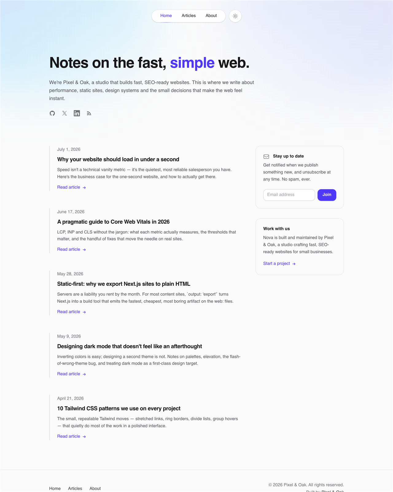

# Nova — a Next.js blog template that's finished on day one

Nova is a free, open-source **Next.js blog template** with the polish of a premium theme: refined editorial typography, a floating pill navigation, first-class dark mode, and signature aurora-gradient art — all exported to plain static HTML that deploys anywhere for free.

Write posts in markdown. Get article pages, tag filters, reading times, RSS, a sitemap and generated cover art out of one `next build`. No CMS, no database, no stock photos, no server.

**Live demo → [pixelandoak-nova.pages.dev](https://pixelandoak-nova.pages.dev)**



## Features

- ⚡ **Fully static** — `output: 'export'` emits plain HTML to `/out`; host it free on Cloudflare Pages, Vercel, Netlify or GitHub Pages
- 🌗 **First-class dark mode** — class strategy, system-preference aware, persisted toggle, zero flash on load
- ✍️ **Markdown content** — one `.md` file per post with simple frontmatter; GitHub-flavored markdown supported
- 🎨 **Generated cover art** — deterministic tag-based gradients mean the template looks finished with zero images
- 🧭 **Floating pill navigation** — backdrop-blurred, detached from the top edge, collapses to a menu on mobile
- 🌌 **Aurora hero** — Nova's signature soft gradient wash, tuned separately for light and dark
- 📚 **Beautiful typography** — tuned `@tailwindcss/typography` prose with custom dark-glass code blocks and syntax highlighting
- 🏷️ **Tag system** — client-side tag filtering on the articles index, tag pills on every post
- ⏱️ **Reading time** — computed from word count at build time
- 📡 **RSS + sitemap + robots.txt** — generated on every build by a tiny Node script
- 🔍 **SEO-ready** — per-page metadata, Open Graph and Twitter cards via the Next.js Metadata API
- 🧩 **No icon or font dependencies** — inline SVGs and a fast system font stack
- ♿ **Accessible details** — labeled icon buttons, keyboard-friendly nav, stretched-link cards, semantic markup

## Tech stack

[Next.js 15](https://nextjs.org) (App Router) · [TypeScript](https://www.typescriptlang.org) · [Tailwind CSS v4](https://tailwindcss.com) · [react-markdown](https://github.com/remarkjs/react-markdown) + [remark-gfm](https://github.com/remarkjs/remark-gfm) · [rehype-highlight](https://github.com/rehypejs/rehype-highlight) · [gray-matter](https://github.com/jonschlinkert/gray-matter)

## Quick start

```bash
# 1. Grab the template
git clone https://github.com/haider484991/nova-nextjs-blog-template.git my-blog
cd my-blog

# 2. Install
npm install

# 3. Develop
npm run dev        # http://localhost:3000

# 4. Build the static site
npm run build      # generates rss.xml + sitemap.xml, then exports to /out
npm run preview    # serve /out locally
```

## Writing content

Posts live in `content/posts/`. One markdown file per post — the filename becomes the URL slug (`hello-world.md` → `/articles/hello-world/`).

```md
---
title: "Hello, world"
date: "2026-07-01"
excerpt: "A one-or-two sentence summary shown on cards, in search results and in the RSS feed."
tags: ["engineering", "notes"]
---

Your markdown starts here. GitHub-flavored markdown is supported —
tables, task lists, strikethrough, autolinks — plus fenced code blocks
with syntax highlighting.
```

### Frontmatter reference

| Field     | Type       | Required | Notes                                                        |
| --------- | ---------- | -------- | ------------------------------------------------------------ |
| `title`   | `string`   | yes      | Shown on cards, the post page, `<title>` and social cards    |
| `date`    | `"YYYY-MM-DD"` | yes  | Controls ordering, display date, RSS `pubDate`, sitemap      |
| `excerpt` | `string`   | yes      | Card/OG description and RSS item description                 |
| `tags`    | `string[]` | no       | Powers the tag filter, tag pills and the generated cover art |

Reading time is computed automatically. Cover art is generated from the tags — same tags, same gradient, every build.

## Customization

### Site name, URL and socials

Everything site-wide lives in **`lib/site.ts`** — name, title, description, canonical URL, author info and social links. The RSS/sitemap script keeps its own copy of the URL and title at the top of **`scripts/rss.mjs`**; update both, plus the sitemap URL in `public/robots.txt`, when you change domains.

### Accent color

Nova's accent is indigo. Because the accent is expressed as standard Tailwind utilities, a project-wide find-and-replace of `indigo-` → `sky-` (or `emerald-`, `rose`, `violet`…) restyles the whole template, aurora and gradients included. For a custom brand color, define it in `app/globals.css` under `@theme` and swap the utilities once.

### Fonts

Nova ships with a system font stack (zero network cost, zero layout shift). Prefer a web font? Add one with [`next/font`](https://nextjs.org/docs/app/building-your-application/optimizing/fonts) in `app/layout.tsx` and update `--font-sans` in `app/globals.css`.

### Navigation

Nav links are defined once in `components/Header.tsx` (and mirrored in `components/Footer.tsx`). Add a page in `app/your-page/page.tsx`, then add `{ href: "/your-page", label: "Your page" }` to both lists.

### Newsletter form

The "Stay up to date" card in `components/NewsletterCard.tsx` is intentionally unwired. Point the `<form action>` at your provider — Buttondown, Kit, Mailchimp and Loops all accept simple HTML form posts.

### Gradient covers

The six cover gradients live in `lib/gradients.ts`. Edit the list to retheme every card at once — covers are deterministic, so posts keep their art between builds.

## Deploying

Nova builds to a plain static site in `/out`, so any static host works.

### Cloudflare Pages

1. Push your repo to GitHub, then in the Cloudflare dashboard: **Workers & Pages → Create → Pages → Connect to Git**
2. Build command: `npm run build` — Output directory: `out`
3. Deploy. Every push to your production branch redeploys automatically.

### Vercel

1. **Add New Project**, import the repo — Vercel detects Next.js automatically
2. Because `output: 'export'` is set in `next.config.ts`, the default `npm run build` produces the static export; no extra configuration needed

### Netlify

1. **Add new site → Import an existing project**
2. Build command: `npm run build` — Publish directory: `out`

### Anywhere else

`npm run build`, then upload the contents of `/out` — GitHub Pages, S3 + CloudFront, or any web server that can serve files.

## Attribution

The footer includes a small "Built by Pixel & Oak" link. It's the only thing we ask for in exchange for a free template — but it's a request, not a requirement. The MIT license means **you're free to remove it** (see `components/Footer.tsx`). If you keep it, thank you — it genuinely helps.

## License

[MIT](./LICENSE) © Pixel & Oak. Use it for anything, personal or commercial.

---

Built by [Pixel & Oak](https://pixelandoak.com) — we build fast, SEO-ready websites. If you'd like one without building it yourself, [say hello](https://pixelandoak.com?utm_source=nova-template).
